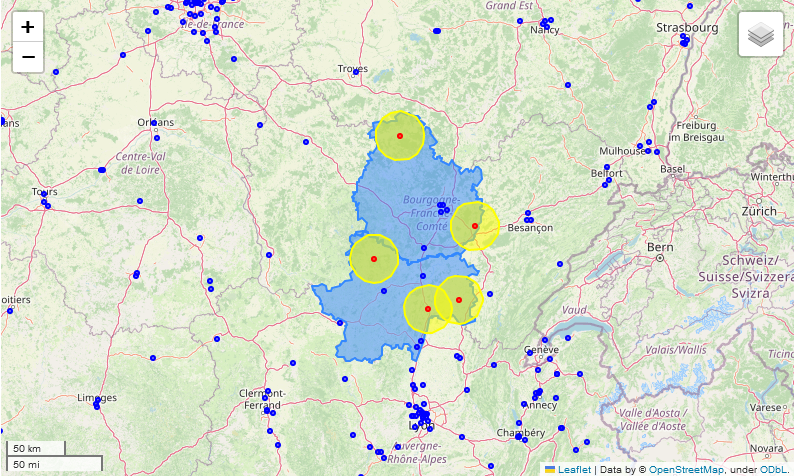

# Identification de villes candidates pour l’implantation d’une salle de sport
Projet personnel

## Contexte
L'objectif de ce projet est d'identifier des villes candidates pour l'implantation d'une salle de Crossfit (aussi appelée <b>"box"</b> ou <b>"affiliée"</b> dans le jargon).
Les paramètres pris en compte sont la taille de la ville et le nombre de salles déjà implantées dans les environs.

 
<i>Exemple de résultat : 
Les points rouges correspondent aux villes de plus de 5000 habitants, situées dans les départements 21 et 71 (surfaces bleues), qui n'ont pas de salles de CrossFit (points bleus) dans un rayon de 20 km (cercle jaune).</i>

## Sources des données
* Salles de CrossFit : https://play-fitness.fr/communaute/boxs/liste-des-boxs/
* Villes et les départements : https://www.data.gouv.fr

## Compétences développées
* Web scraping de données
* Géocodage des adresses avec l’API Python de Bing
* Utilisation de l'algorithme des plus proches voisins (KNN) pour calculer le nombre de salles voisines pour chaque ville d'intérêt
* Manipulation de données géographiques avec la librairie Geopandas
* Représentation des données sur une carte interactive